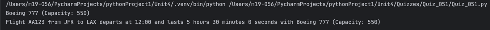
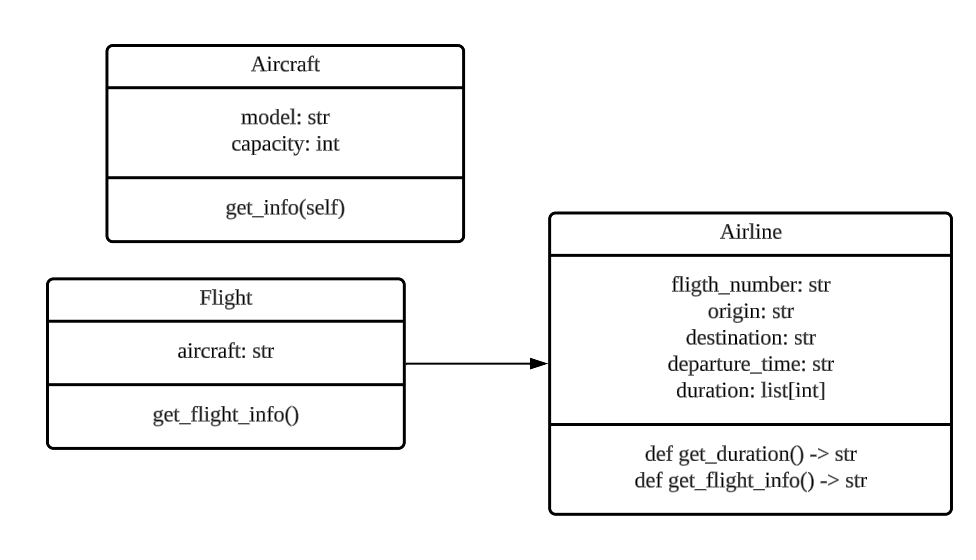
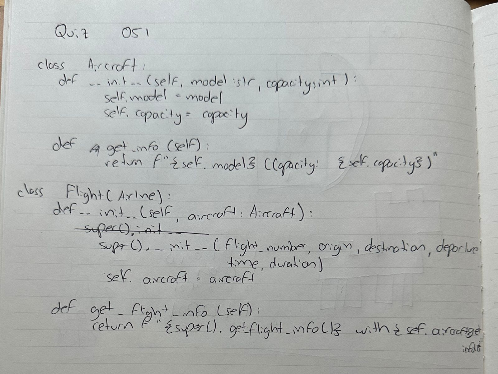

# Quiz 051
## The Aircraft class represents a generic aircraft and has two attributes: ✈️
## model (string): such as "Boeing 737"
## capacity (int): maximum number of passengers, such as 100
## 1)The Aircraft class includes a get_info method that returns a string representation of the aircraft, such as, “Boeing 737 (Capacity: 150)”
## 2)The Flight method now inherits from Aircraft. Modify as needed.
## 3)Add the same method to the Flight class, to produce the string: “Flight AA123 from New York to Los Angeles departs at 10:00 AM. Aircraft: Boeing 737 (Capacity: 150)”
## 4)Create an Aircraft and one Flight object.
## 5)Create a function print_object_info(object) that receives any type of object (Aircraft or Flight) and prints its information. 
### Python Code
```python
from Quizzes.Quiz_050.Quiz_050 import Airline

class Aircraft:
    def __init__(self, model: str, capacity: int):
        self.model = model
        self.capacity = capacity

    def get_info(self):
        return f"{self.model} (Capacity: {self.capacity})"

class Flight(Airline):
    def __init__(self, flight_number: str, origin: str, destination: str, departure_time: str, duration: list[int], aircraft: Aircraft):
        super().__init__(flight_number, origin, destination, departure_time, duration)
        self.aircraft = aircraft

    def get_flight_info(self):
        return f"{super().get_flight_info()} with {self.aircraft.get_info()}"

aircraft = Aircraft("Boeing 777", 550)
print(aircraft.get_info())
flight = Flight("AA123", "JFK", "LAX", "12:00", [5, 30, 0], aircraft)
print(flight.get_flight_info())
```

### Proof



*Fig.1* Proof of the code for Quiz 051


### UML Diagram



*Fig.2* UML Diagram for Quiz 051


### Work on paper


*Fig.3* Work on paper for Quiz 051
