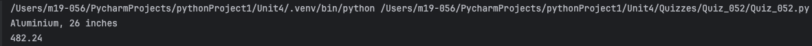
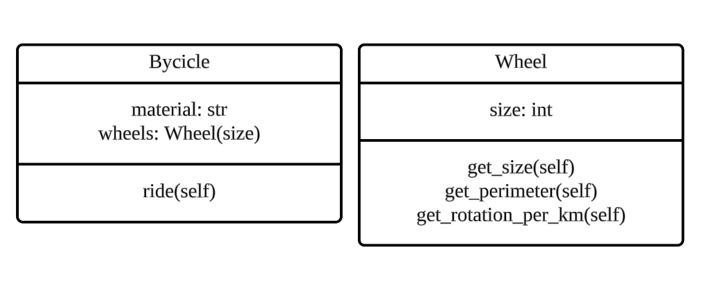
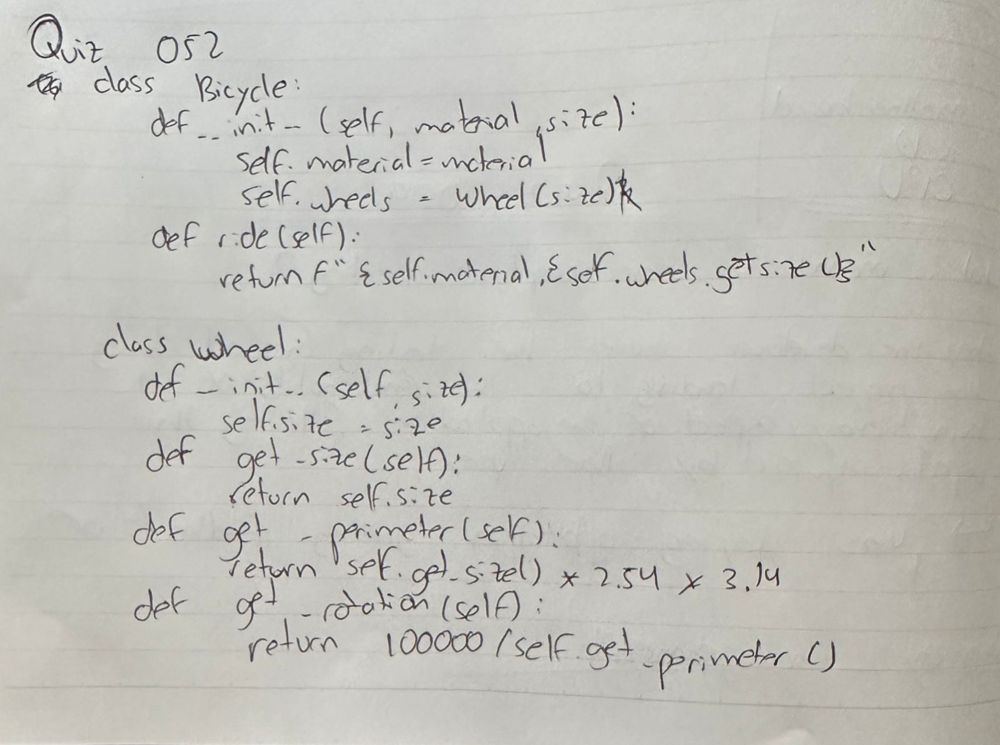

# Quiz 052
## Create a Bicycle class with a Wheel class as its attribute using composition. 🚲

## The Bicycle class should have a ride() method that prints the wheel size and frame material of the bicycle. The Wheel class should have a get_size() method that returns the size of the wheel, as well as a get_perimeter() method that returns the perimeter of the wheel and a get_km_per_rotation() method that returns the distance traveled in kilometers per rotation. 

## Create an object for a bicycle with wheel size 26 and frame aluminum. How many km per rotation do you get on that bicycle?
### Python Code
```python
class Bicycle:
    def __init__(self, material: str, size: int):
        self.material = material
        self.wheels = Wheel(size)

    def ride(self):
        return f"{self.material}, {self.wheels.get_size()} inches"


class Wheel:
    def __init__(self, size: int):
        self.size = size

    def get_size(self):
        return self.size

    def get_perimeter(self):
        return self.get_size() * 2.54 * 3.14

    def get_rotation_per_km(self):
        return round(100000 / self.get_perimeter(), 2)


test = Bicycle("Aluminium", 26)
print(test.ride())

test2 = Wheel(26)
print(test2.get_rotation_per_km())
```

### Proof



*Fig.1* Proof of the code Quiz 051


### UML Diagram



*Fig.2* UML Diagram of the code Quiz 051


### Work on paper



*Fig.3* Work on paper Quiz 051
