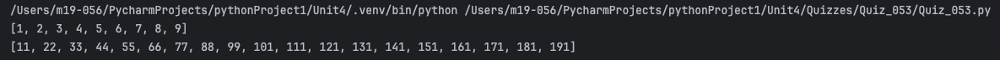
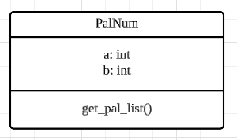
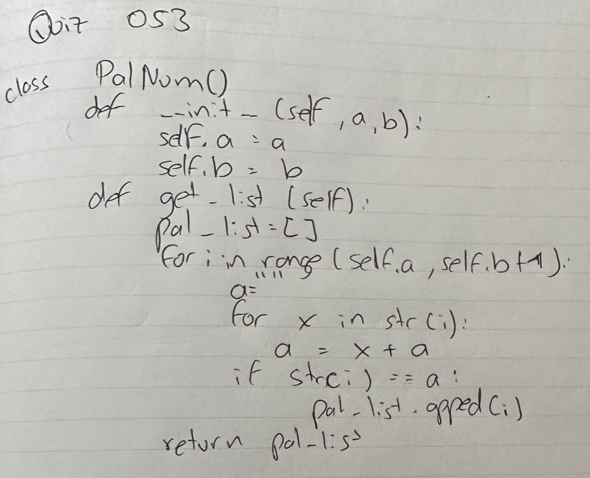

# Quiz 053
## Create a class palNum with a method get_pal_list() that returns a list with the palindromic numbers inside a range A, B inclusive. A and B are class attributes.
### Python Code
```python
class PalNum():
    def __init__(self, a, b):
        self.a = a
        self.b = b

    def get_pal_list(self):
        pal_list = []
        for i in range(self.a, self.b + 1):
            a = ""
            for x in str(i):
                a = x + a
            if str(i) == a:
                pal_list.append(i)
        return pal_list

test = PalNum(1, 9)
test2 = PalNum(10, 199)
print(test.get_pal_list())
print(test2.get_pal_list())
```

### Proof



*Fig.1* Proof for Quiz 053


### UML Diagram



*Fig.2* UML Diagram for Quiz 053


### Work on paper


*Fig.3* Work on paper for Quiz 053