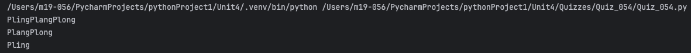
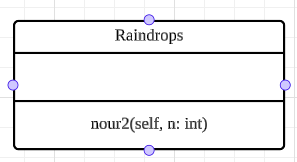
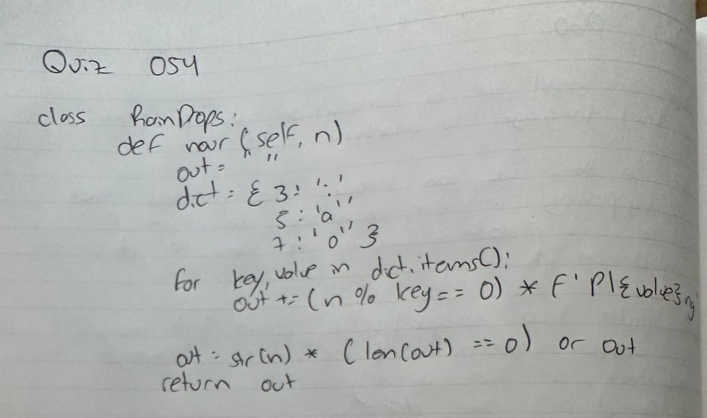

# Quiz 054
## Create a class rainDrops with a method pour(n:int) that convert the number n into its corresponding raindrop sounds.
### Python Code
```python
class rainDrops:
    def nour2(self, n: int):
        out = ''
        dict = {3: 'i',
                5: 'a',
                7: 'o'}
        for key, value in dict.items():
            out += (n % key == 0) * f'Pl{value}ng'

        out = str(n) * (len(out) == 0) or out

        return out

test1 = rainDrops()
print(test1.nour2(35*3))
```

### Proof



*Fig.1* Proof for Quiz 054


### UML Diagram



*Fig.2* UML Diagram for Quiz 054


### Work on paper


*Fig.3* Work on paper for Quiz 054