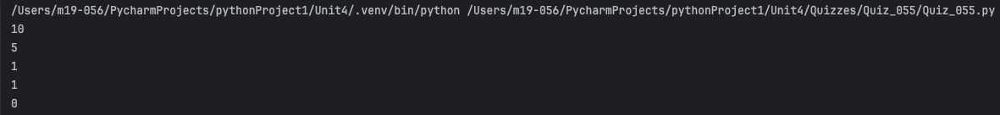
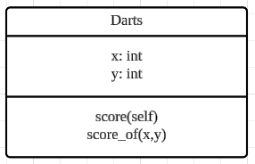
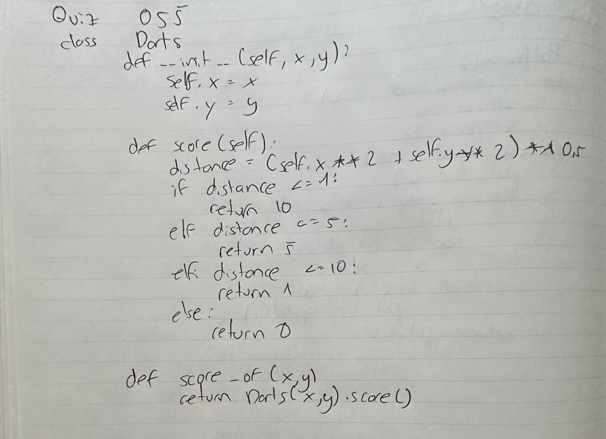

# Quiz 055
## Create a class darts that includes method to calculate the earned points in a single toss of a Darts game where the inputs are the coordinates x, y of the dart.
### Python Code
```python
class Darts:
    def __init__(self, x, y):
        self.x = x
        self.y = y

    def score(self):
        distance = (self.x ** 2 + self.y ** 2) ** 0.5
        if distance <= 1:
            return 10
        elif distance <= 5:
            return 5
        elif distance <= 10:
            return 1
        else:
            return 0

    def score_of(x, y):
        return Darts(x, y).score()

print(Darts.score_of(0, 0))
print(Darts.score_of(5, 3))
print(Darts.score_of(7, 8))
```

### Proof



*Fig.1* Proof of the Quiz 055


### UML Diagram



*Fig.2* UML Diagram of the Quiz 055


### Work on paper



*Fig.3* Work on paper of the Quiz 055