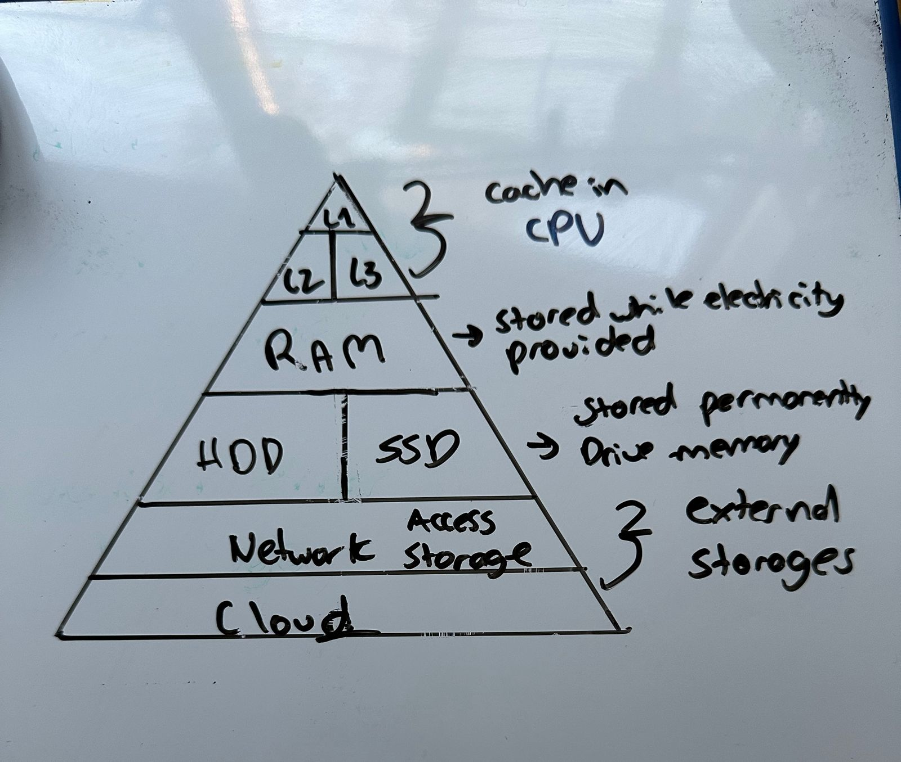

# Quiz 057
### Complete the diagram below showing the memory hierarchy in the computer:

*Fig.1* Memory hierarchy in the computer

### How many different colors can be represented in a computer with a 9-bit processor?
R\\ A 9-bit processor can represent 2^9 = 512 different colors. 

