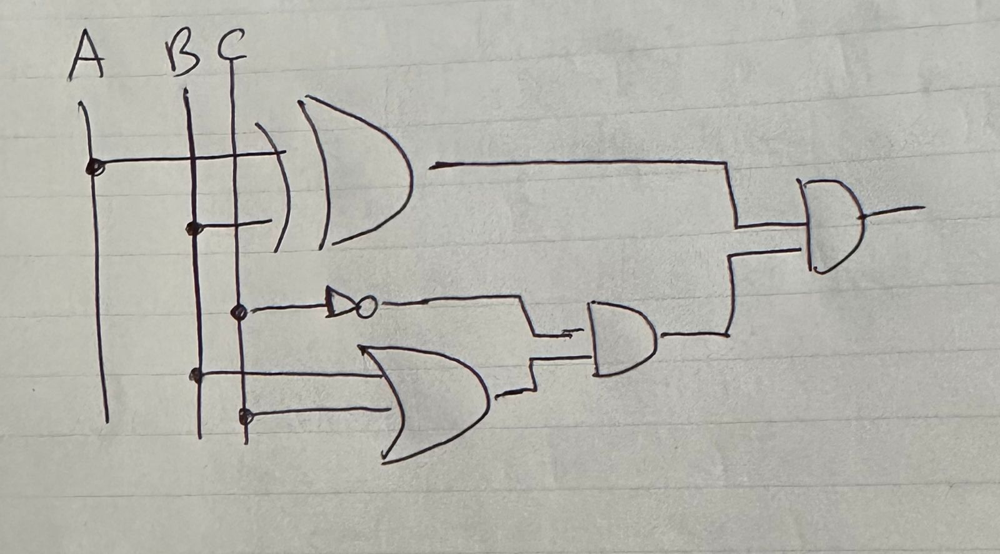

# Quiz 058
### Describe the role of the ROM memory in a computer.
R\\ Contains the programming that allows a computer to start up. It is read-only memory, which means that the data stored in it cannot be modified or changed by the computer.

### Draw the logic circuit for the following boolean expression:

*Fig.1* Logic circuit for the boolean expression